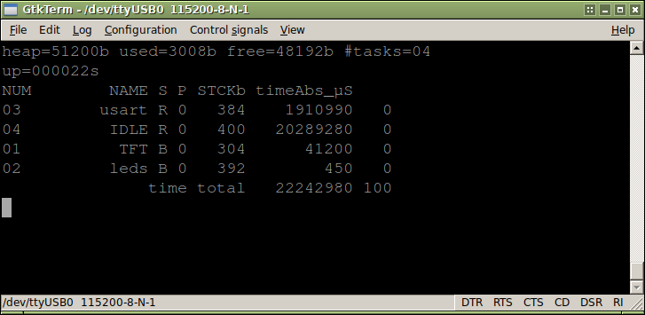

### FreeRTOS 9.0.0 configured for HY-MiniSTM32 + TFT + SD/FAT32 drivers

This is a ready-to-run project glueing together a lot giving this environment:  
* FreeRTOS 9.0.0, heap_4 (dynamic allocation/freeing), 50kB heap assigned
* SSD1289 tft driver, basic drawing functions, a lot of fonts (including IBM XGA BIOS 8x8/8x14/8x16)
* sdio+DMA driver for onboard µSD slot
* Elm Chan's FatFS 0.12
* ST stdperiph fw lib 3.5.0

Makefile is configured to use newlib nano. Example project uses ~33k flash memory.

