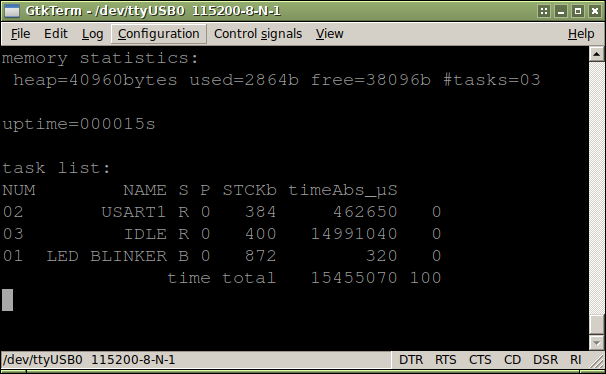

# HY-MiniSTM32V libopencm3 USART1 example
This folder contains a simple example for FreeRTOS 9.0.0 on the HY-MiniSTM32V board using [libopencm3](https://github.com/libopencm3/libopencm3). It's controller is a `STM32F103VCT6`.

This example uses USART1 to communicate with 115200,8n1 baud. USART1 is connected to an onboard PL2303 (right USB plug). Also LED1 will be blinking.  
  
FreeRTOS is configured to heap_4, which allows dynamic allocation/freeing of memory. This is what people are used to on a regular PC.  
40kB of heap are allocated for FreeRTOS, see here:



# RunTime-Statistics
For getting runtime statistics TIM2 will fire with a frequency of 10kHz, which is 10 times as fast a the SysTick interrupt, that drives FreeRTOS.
This is usually not needed in production systems, but very useful for debugging. This ruins real time behaviour, as FreeRTOS does not know about these interrupts.  
See FreeRTOS documentation for details.

# Requirements
You will need a suitable arm-gcc for building and texane's st-link utility for flashing.  
If you're using ARM's official gcc distribution everything will be fine.
  
libopencm3 is included in this archive.  

# Compiling
```
$ make
```
This will build libopencm3 and the demo-code. It will generate an ELF, a BIN and a HEX binary,
as well as listing and map files.

# libopencm3
There is a "static" copy of libopencm3 in `src/` unlike other examples and tutorials on the internet,
which use a git submodule to allow automatic updating of libopencm3.  
I prefer *not* to update a project's library once it is working, as it could break things.  
Once you're done and your device is running the working firmware you really should keep a exact copy
of your sourcecode.  
Updating is a good thing, but only if you know what you're doing and in this case, only if needed.  
  
I have removed a lot of stuff from libopencm3's source directory which targets other MCUs.

# Licensing
libopencm3 is GNU LGPL v3.  
Makefile and usart-/demo-code written by me is 'public domain'.  

