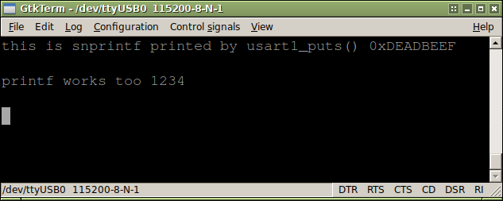

# HY-MiniSTM32V libopencm3 USART1 example
This folder contains a simple example for the HY-MiniSTM32V board using [libopencm3](https://github.com/libopencm3/libopencm3),  
that comes with a `STM32F103VCT6` controller.  
  
This example uses USART1 to communicate with 115200,8n1 baud. USART1 is connected to an onboard PL2303 (right USB plug).  
libopencm3 provides some examples for the neccessary syscall (`_write()`) in their documentation, see `src/usart.c` comments
for details.  
  



# Requirements
You will need a suitable arm-gcc for building and texane's st-link utility for flashing.  
If you're using ARM's official gcc distribution everything will be fine.
  
libopencm3 is included in this archive.  

# Compiling
```
$ make
```
This will build libopencm3 and the demo-code. It will generate an ELF, a BIN and a HEX binary,
as well as listing and map files.

# libopencm3
There is a "static" copy of libopencm3 in `src/` unlike other examples and tutorials on the internet,
which use a git submodule to allow automatic updating of libopencm3.  
I prefer *not* to update a project's library once it is working, as it could break things.  
Once you're done and your device is running the working firmware you really should keep a exact copy
of your sourcecode.  
Updating is a good thing, but only if you know what you're doing and in this case, only if needed.  
  
I have removed a lot of stuff from libopencm3's source directory which targets other MCUs.

# Licensing
libopencm3 is GNU LGPL v3.  
Makefile and usart-/demo-code written by me is 'public domain'.  

